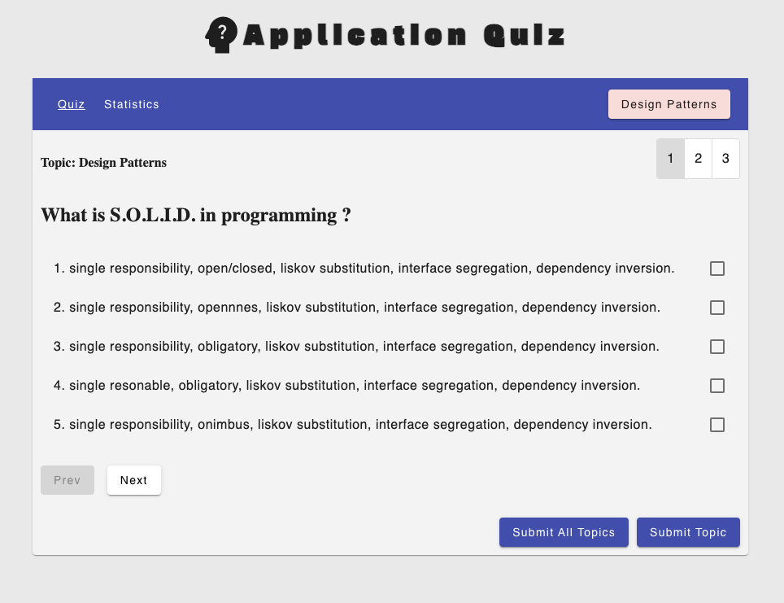
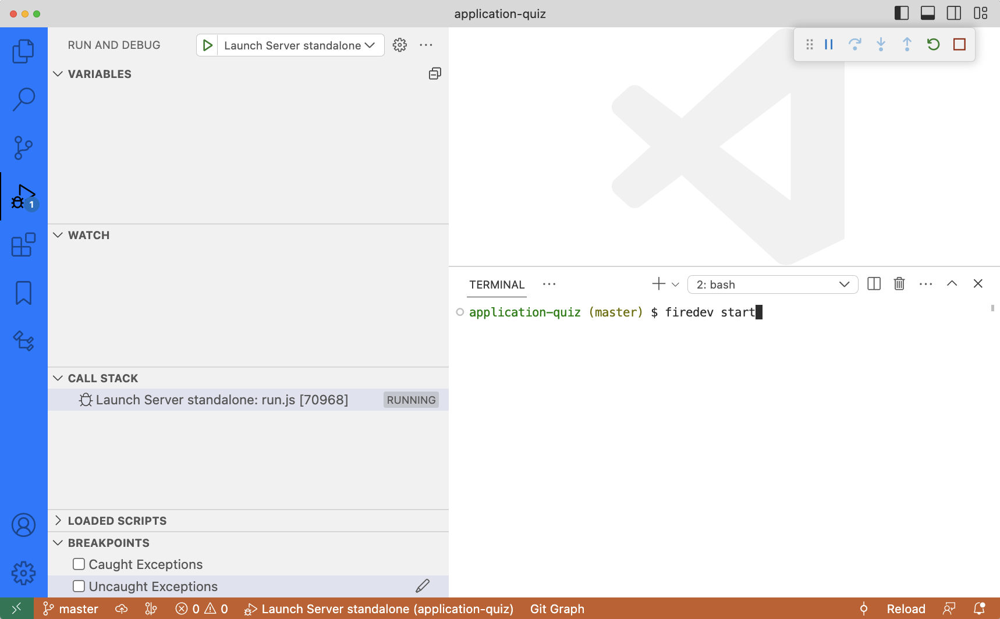
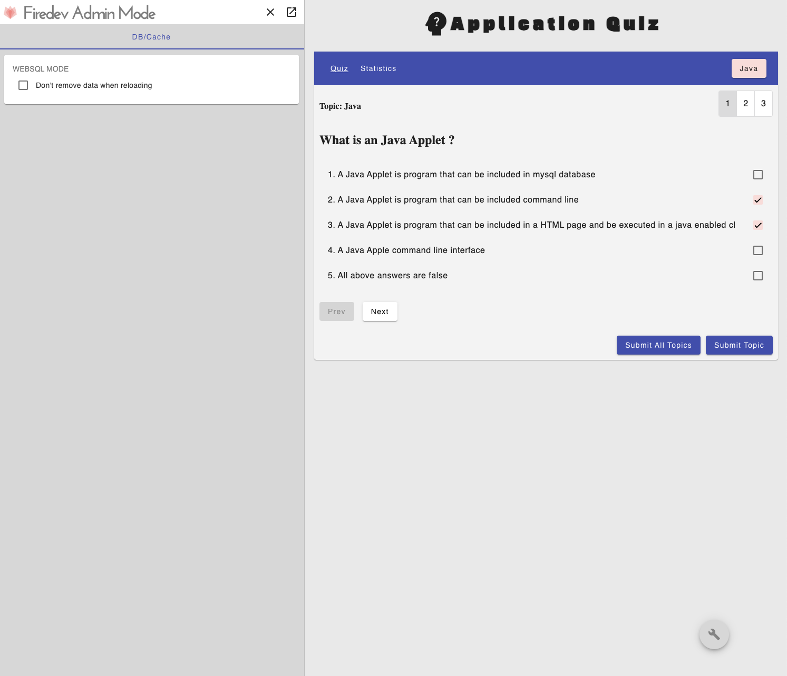

#  application-quiz

<p style="text-align: center;"></p>

# Technolgies
- Firedev v16 (firedev.io)
- Angular v16
- NgRx v16
- TypeORM (SQL.js in browser/ SQLite in Nodejs server)


# Development

1. Instal firedev:
```
npm i -g firedev
```


2. Start application with TypeORM/SQL.js db inside BROWSER - simplest way to develop.
```
firedev start --websql    # and go to http://localhost:4201
```

or start normal NodeJS server from vscode

```
firedev start  # and go to http://localhost:4200 
```
      
<p style="text-align: center;"></p>

# Bugs / Todo
- exhaustMap rxjs for buttons
- remove firstValueFrom -> make it reactive
- production bug (TypeORM is adding on production empty entities to db)
- tests: unit (jest, cucumber component tests) + e2e (cucumber e2e)


# DEMO SQL.JS DATABASE IN BROWSER

https://darekf77.github.io/application-quiz/#/quiz


<p style="text-align: center;"></p>
